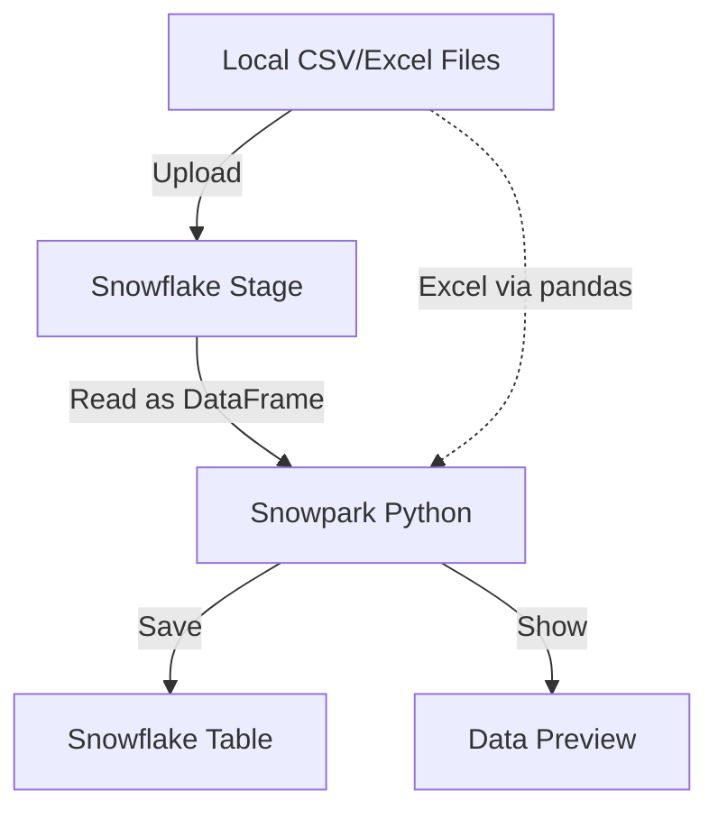

<p align="center">
  
</p>

# Snowflake Snowpark Project Documentation

Welcome to the **Snowflake Snowpark Data Engineering Project**! This guide not only explains the code, but also provides practical scenarios, diagrams, and resources to help you master Snowpark for Python.

---

## 📊 Project Architecture Diagram



---

This document explains the structure, logic, and significance of each function and line in the main project files for the Snowflake Snowpark data loading and analysis workflow.

## File: analysis.py

### Imports
- `from snowflake_connection import get_snowflake_session`: Imports a helper function to create a Snowflake session using credentials from `config.ini`.
- `from snowflake.snowpark import DataFrame`: Imports the DataFrame class for Snowpark operations.
- `from snowflake.snowpark.types import StructType, StructField, IntegerType, StringType`: Imports types for explicit schema definition.
- `import os`: Used to check for file existence on the local filesystem.

### Class: SnowparkTableManager
- **Purpose:** Encapsulates table creation and data display logic for Snowflake tables using Snowpark.

#### `__init__(self, session, table_name)`
- Stores the Snowpark session and the table name for later use.

#### `create_table_from_dataframe(self, df: DataFrame)`
- Saves the provided DataFrame as a table in Snowflake, overwriting if it exists.
- Prints a confirmation message.

#### `show_table_data(self, n=10)`
- Reads the table from Snowflake and displays the first `n` rows using Snowpark's `show()` method.

### Function: run_analysis()
- **Purpose:** Orchestrates the workflow for uploading a CSV, creating a table, and displaying data.

#### Steps:
1. **Create Snowflake session:**
   - `session = get_snowflake_session()`
2. **Create named stage if not exists:**
   - `session.sql("CREATE STAGE IF NOT EXISTS LOCAL_FILE_STAGE").collect()`
   - Ensures a Snowflake stage exists for file uploads.
3. **Upload CSV to stage:**
   - Checks if the local CSV exists with `os.path.exists(local_csv_path)`.
   - If yes, uploads it to the stage using `session.file.put()`.
   - Prints a message about the upload status.
4. **Define schema explicitly:**
   - Uses `StructType` and `StructField` to define the table schema as (id: int, name: str, value: int).
5. **Load CSV from stage:**
   - Reads the CSV from the stage using the defined schema and options (comma delimiter, skip header).
6. **Create table from DataFrame:**
   - Uses `SnowparkTableManager` to save the DataFrame as a table in Snowflake.
7. **Show table data:**
   - Displays the first 10 rows of the table.

## File: snowpark_loader.py

### Class: SnowparkDataLoader
- **Purpose:** Encapsulates logic for uploading files to a stage and loading data into Snowflake tables from CSV and Excel files.

#### `upload_csv_to_stage(self, file_path, stage_name="LOCAL_FILE_STAGE")`
- Creates the stage if it doesn't exist.
- Checks if the local file exists.
- Uploads the file to the specified stage using `session.file.put()`.
- Prints upload status.

#### `load_csv_with_inferschema(self, stage_name, file_name, table_name)`
- Constructs the stage file path.
- Reads the CSV from the stage using Snowpark's schema inference and options (comma delimiter, skip header).
- Appends the data to the specified table.
- Prints a confirmation message.

#### `load_excel_with_pandas(self, file_path, table_name)`
- Reads the Excel file using pandas and the openpyxl engine.
- Converts the pandas DataFrame to a Snowpark DataFrame.
- Appends the data to the specified table.
- Prints a confirmation message.

### Main Block
- Creates a Snowflake session.
- Instantiates the loader.
- Uploads the CSV to the stage.
- Loads the CSV and Excel data into the `sample_table` table.


---

## 💡 Example Scenarios

### 1. Data Quality Checks
You can use Snowpark to run data validation before loading into production tables:
```python
df = session.table("sample_table")
df.filter(df["value"] < 0).show()  # Find negative values
```

### 2. Data Transformation
Add new columns or transform data before saving:
```python
df = session.table("sample_table")
df = df.with_column("value_squared", df["value"] * df["value"])
df.write.save_as_table("sample_table_transformed", mode="overwrite")
```

### 3. Joining with Other Tables
```python
df1 = session.table("sample_table")
df2 = session.table("other_table")
joined = df1.join(df2, df1["id"] == df2["id"])
joined.show()
```

### 4. Loading Large Files
For large files, split and upload in chunks, or use Snowflake's external stages (S3, Azure Blob, GCS).

---

## 🖼️ Visual Example: Data Flow

<p align="center">
  
</p>

---

## 📚 Further Reading & Resources

- [Snowpark for Python Developer Guide](https://docs.snowflake.com/en/developer-guide/snowpark/python/index.html)
- [Snowflake Stages Documentation](https://docs.snowflake.com/en/user-guide/data-load-local-file-system-create-stage.html)
- [Snowpark API Reference](https://docs.snowflake.com/en/developer-guide/snowpark/reference/python/index.html)
- [Snowflake Labs - Snowpark Examples](https://github.com/Snowflake-Labs/sfguide-snowpark-python)
- [Best Practices for Data Loading](https://docs.snowflake.com/en/user-guide/data-load-overview.html)

---

## 🎯 Tips for Success

- Always validate your data after loading.
- Use explicit schema definitions for reliability.
- Use stages for all file-based data loads.
- Leverage Snowpark's DataFrame API for transformations and analytics.

---

<p align="center">
  <b>Happy Snowpark-ing! 🚀</b>
</p>
